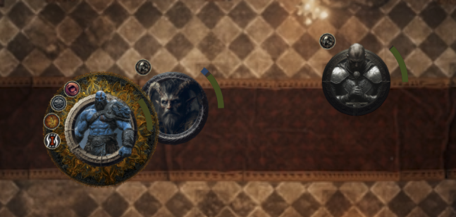

# Health Arc

A Foundry VTT module that visually displays dynamic arcs around tokens to represent current hit points (HP) and temporary hit points.



## Features

- **HP Arc**: A coloured arc appears around each token to indicate its current HP.
- **Temp HP Arc**: A separate arc is shown for any temporary hit points.
- **Visibility for Non-Owners**: Players who do not own the token and non-GMs will see a "fuzzed" HP arc. The level of uncertainty decreases with higher passive perception.
- **Fade Out Effect**: When tokens are not in combat, not hovered over, or not selected, their health arcs fade out for a cleaner display.
- **Colour Customisation**: Fully customise the colours used for the health arcs, including high HP, low HP, temporary HP, and background arc.
- **Perception-Based Settings**: Configure how perception affects the uncertainty of HP display for non-owned tokens.
- **Intelligent Batching**: Optimized rendering with prioritized token updates to ensure smooth performance even with many tokens.
- **Performance Monitoring**: Built-in performance monitoring tools for advanced debugging.
- **Flexible Logging System**: Advanced debug logging with separate log levels for debug and normal operation modes.
- **Internationalisation**: Supports multiple languages, with Australian English :)available out of the box.

## Performance Optimisations

- **Token Prioritisation**: Critical tokens (selected, in combat) are updated first for better responsiveness
- **Adaptive Batch Processing**: Rendering work is split into optimally-sized batches based on the number of active tokens
- **Frame Timing**: Rendering is spread across multiple frames to avoid UI lag
- **Resource Pooling**: Graphics objects are pooled and reused to reduce memory churn
- **Optimised Geometry Calculations**: Token geometry is cached with intelligent TTL and cleanup
- **Throttled Hooks**: Event handlers use throttling and debouncing to reduce update frequency
- **Reduced Dynamic Imports**: Critical code paths use direct imports for faster startup
- **Memory Usage Optimisations**: Improved cleanup of PIXI objects and event listeners

## Configuration

After enabling the module, visit the module settings to customise:

- **Colours**: Set the colours for high HP, low HP, temporary HP, and background arc
- **Perception Settings**: Adjust how perception affects the uncertainty for non-owned tokens
- **Performance Settings**: Enable performance monitoring and debug visualizations

### Debug Features

When debug mode is enabled, you can access:

- **Performance Overlay**: Shows real-time performance metrics
- **Performance Monitoring**: Tracks render times and operation counts
- **Debug Visualizations**: Visual indicators for arc geometry and calculations
- **Console Commands**: Additional debugging helpers via `game.modules.get('health-arc').debugHelpers

## Project Structure

```
health-arc/
├── languages/            # Internationalisation files
│   ├── en.json           # English translations
│   └── en-AU.json        # Australian English translations
├── src/
│   ├── core/             # Core health arc functionality
│   │   ├── arc-batcher.ts    # Batches draw operations with priority
│   │   ├── arc-cache.ts      # Caches HP uncertainty values
│   │   ├── arc-geometry.ts   # Handles geometric calculations with caching
│   │   └── renderer-functions.ts # Function registry for renderer
│   ├── hooks/            # Foundry VTT hook registrations
│   │   ├── index.ts          # Hooks setup and registration
│   │   └── optimized-hooks.ts # Performance-optimized event handlers
│   ├── settings/         # Module settings
│   │   └── settings.ts   # Settings registration and getters
│   ├── styles/           # SCSS stylesheets
│   │   └── main.scss     # Main stylesheet
│   ├── types/            # TypeScript type definitions
│   │   ├── foundry.d.ts  # Foundry VTT type definitions
│   │   └── index.ts      # Type definitions index
│   ├── ui/               # User interface components
│   │   ├── arc-renderer.ts   # Renders the health arcs
│   │   ├── arc-drawing.ts    # Drawing functions
│   │   ├── container-manager.ts # Container management
│   │   ├── debug-visualization.ts # Debug visualizations
│   │   ├── hp-calculation.ts # HP calculations
│   │   └── token-helpers.ts  # Token utility functions
│   ├── utils/            # Utility functions and constants
│   │   ├── constants.ts      # Module constants
│   │   ├── container-helpers.ts # Container helpers
│   │   ├── graphics-pool.ts  # Graphics pooling for performance
│   │   ├── i18n.ts           # Internationalization helpers
│   │   ├── logger.ts         # Logging utilities
│   │   ├── performance.ts    # Performance monitoring
│   │   ├── resource-management.ts # Resource cleanup
│   │   ├── token-utils.ts    # Token manipulation helpers
│   │   └── type-guards.ts    # Type guards for safer type handling
│   └── module.ts         # Main entry point
├── module.json           # Module manifest
├── package.json          # NPM package configuration
├── tsconfig.json         # TypeScript configuration
└── vite.config.mjs       # Vite build configuration
```

## Compatibility

Developed and tested for Foundry VTT version 13+.

## Language Support

- English
- English (Australian)

## Development

### Performance Tools

The module includes built-in performance monitoring tools:

- **PerformanceMonitor**: Records timings and operation counts
- **Debug Overlay**: Real-time performance stats overlay
- **Console Commands**: Access performance data via `game.modules.get('health-arc').debugHelpers.performance()`

### Logging System

The module implements a flexible logging system with the following features:

- **Debug Mode**: Toggles between normal operation and debug mode
- **Contextual Log Levels**:
  - When debug mode is ON: Only TRACE and DEBUG levels are available
  - When debug mode is OFF: Only INFO, WARN, ERROR, and NONE levels are available
- **Separate Settings**: Different log level settings for debug and normal operation modes
- **Automatic Switching**: Log levels are automatically switched when debug mode changes

### Building the Module

```bash
# Install dependencies
npm install

# Development build with source maps
npm run dev

# Production build
npm run build:production

# Development mode with auto-rebuild
npm run watch

# Run type checking
npm run lint

# Clean build artifacts
npm run clean
```

## Contributing

Contributions are welcome! Please feel free to submit a Pull Request.

## License

This project is licensed under the GPL-3.0 License - see the LICENSE file for details.
